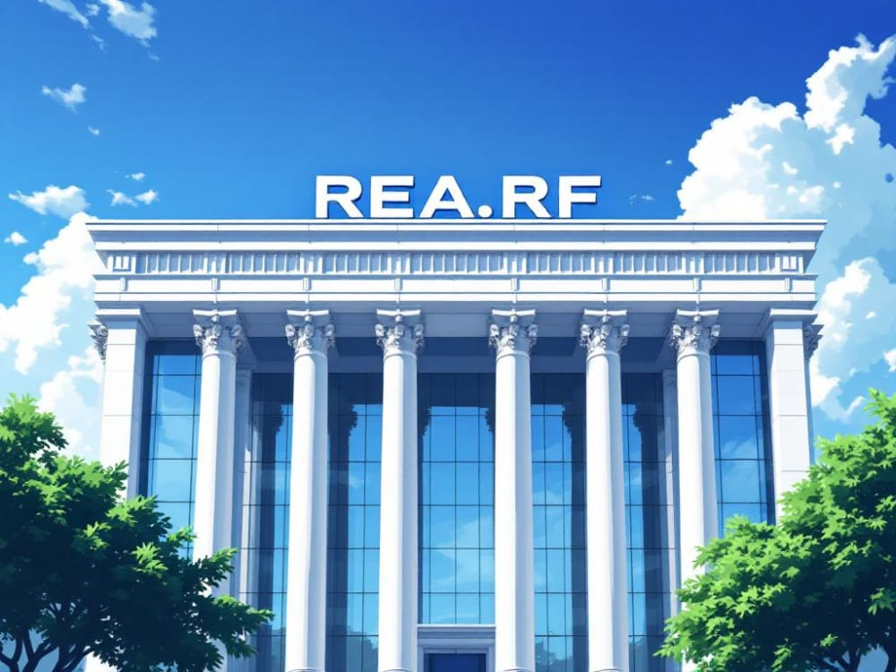

## Ответы для @BlockchainQuestBot

---

### Задание 1

Создан Ethereum-кошелёк с поддержкой тестовых сетей.
Сформирован новый аккаунт и сохранена seed-фраза.

**Адрес кошелька:**
`0xA11B5B2415e83dAA37F061187741ae17C716d62d`

---

### Задание 2

Получен тестовый ETH в сети Sepolia через кран.
Выполнена транзакция перевода тестового ETH на адрес бота.

**Хеш транзакции:**
`0x9c7bcf9a77efa936eb90c645df1ae520e27df09d98dd0c9289f502e3a69a0124`

---

### Задание 3

Вычислен SHA256-хеш от фамилии.
Хеш использован как приватный ключ для импорта второго аккаунта.

**Адрес импортированного аккаунта:**
`0x83dc0aa44D42fbE68bda51ba93Aaf2659c653dE0`

---

### Задание 4

Создан профиль на Rarible с использованием основного аккаунта.
Выполнена подписка на профиль ReuRF.
Создан и выставлен на продажу NFT.

**Ссылка на NFT:**
`https://og.rarible.com/token/0xc9154424b823b10579895ccbe442d41b9abd96ed:72870702524437639344795573516020506036961514190037842031994229461589275181062`

**NFT:**

---

### Задание 5

Смарт-контракт SoulBound-токена REUSBT был корректно подключён в сети Sepolia с использованием предоставленного ABI.  
Была выполнена транзакция вызова функции `mint()` для выпуска токена на адрес кошелька, созданного в задании 1.  

Транзакция была отправлена в блокчейн и обработана смарт-контрактом. 

**Хеш транзакции:**
`0x5addf2922b8a28dea7f88b0fc481e63f03908a93de4fd60ef3661bc7e10cc9c9`

**ID токена:**
`170`

---
